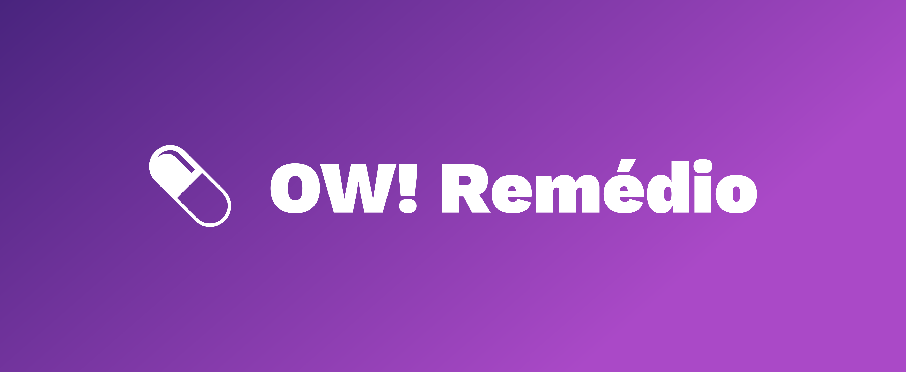
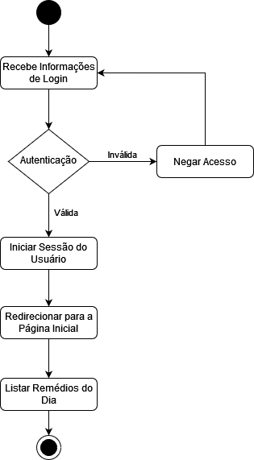
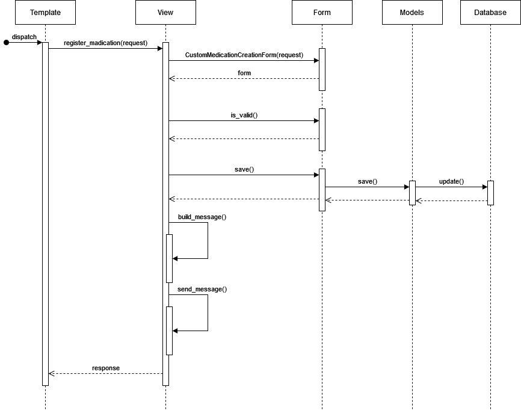

# OW! Remédio

Trabalho Prático realizado para a disciplina de Engenharia de Software do DCC, UFMG.



## 📋 Escopo do Sistema

O aplicativo de gestão de medicação visa facilitar o acompanhamento de tratamentos médicos, alertando o usuário sobre os horários das doses através de notificações personalizáveis e monitorando o estoque de medicamentos para sinalizar quando reabastecer. Com um calendário integrado, o usuário pode verificar a programação diária de medicamentos, enquanto o sistema registra a adesão ao tratamento, oferecendo uma visão geral da regularidade com que as medicações são tomadas. A interface do usuário é projetada para ser intuitiva, proporcionando facilidade na gestão das informações de saúde. Recursos adicionais incluem relatórios mensais de progresso, backup de dados e sincronização entre dispositivos para manter o tratamento organizado e eficaz.

## 👥 Membros da Equipe

- **Daniel Oliveira Barbosa** - Papel: [Backend]
- **Frederico Dolher Souza Baker** - Papel: [Backend]
- **Igor Eduardo Martins Braga** - Papel: [Frontend]
- **Rubia Alice Moreira de Souza** - Papel: [Fullstack]
- **Wallace Eduardo Pereira** - Papel: [Frontend]

## 👥 Como rodar?

- Crie e ative um ambiente virtual:
  
  ```sh
  $ python -m venv venv
  $ source venv/bin/activate

- Instale as dependencias:
  
  ```sh
  $ pip install -r requirements.txt

- Configure as variáveis de ambiente:
  
  Copie o arquivo `.env.example` para um novo arquivo chamado `.env` e atualize-o com as suas configurações locais.
  
- Faça a migração:
  
  ```sh
  $ python3 manage.py makemigrations
  $ python3 manage.py migrate
  
- Depois rode o servidor e as tarefas cron:

  Para isso você pode utilizar o script `start_dev.sh`. Certifique-se de que o script tenha permissão de execução:
  
  ```sh
  $ chmod +x start_dev.sh
  $ ./start_dev.sh

## 🛠 Tecnologias

- Python
- Django
- HTML/CSS
- SQLite

## 📜 Backlog do Produto

1. Como usuário, eu gostaria de criar um cadastro para mim
2. Como usuário, eu gostaria de fazer login e logout
3. Como usuário, eu gostaria de adicionar um remédio
4. Como usuário, eu gostaria de receber uma notificação de quando devo tomar o remédio
5. Como usuário, eu gostaria de ver os remédios que tenho para tomar hoje
6. Como usuário, eu gostaria de informar que um remédio foi tomado
7. Como usuário, eu gostaria de receber uma notificação quando o meu remédio estiver esgotando
8. Como usuário, eu gostaria de ver em um calendário a minha regularidade nos tratamentos
10. Como admin, eu gostaria de excluir um usuário
11. Como admin, eu gostaria de enviar uma notificação para todos os usuários

## 🗂 Backlog do Sprint

### História #1: Como usuário, eu gostaria de criar um cadastro para mim
- **Tarefas e responsáveis:**
  <checkbox>Configurar ambiente de desenvolvimento [Responsável: Daniel]</checkbox>
  - [X] Criar tela de cadastro [Responsável: Igor]
    - [X] Criar campo de email
    - [X] Criar campo de senha
    - [X] Criar campo de nome de usuário
    - [X] Criar campo de número de whatsapp
    - [X] Criar campo botão de confirmação
  - [X] Criar o modelo no banco de dados [Responsável: Daniel]
    - [X] Criar campo de email
    - [X] Criar campo de senha
    - [X] Criar campo de nome de usuário
    - [X] Criar campo de número de whatsapp
  - [X] Criar a view da tela de cadastro [Responsável: Daniel]
  - [X] Criar endpoint de post para criar o cadastro do usuário [Responsável: Daniel]

### História #2: Como usuário, eu gostaria de fazer login e logout
- **Tarefas e responsáveis:**
  - [ ] Criar tela de login [Responsável: Wallace]
    - [X] Criar campo de nome de usuário
    - [X] Criar campo de número de whatsapp
    - [X] Criar campo botão de logout
  - [X] Criar tela de perfil de usuário [Responsável: Wallace]
    - [X] Criar campo botão de confirmação  
  - [X] Criar a view da tela de cadastro [Responsável: Daniel]
  - [X] Criar endpoint de post para login [Responsável: Daniel]

### História #3: Como usuário, eu gostaria de adicionar um remédio
- **Tarefas e responsáveis:**
  - [X] Criar tela de cadastro de remédio [Responsável: Igor]
    - [X] Criar campo de nome de remédio
    - [X] Criar campo de freqência para tomar remédio
    - [X] Criar campo de hora para tomar remédio
    - [X] Criar campo de dose para tomar do remédio
    - [X] Criar campo de data de início de tratamento com remédio
    - [X] Criar campo de data de fim de tratamento com remédio
    - [X] Criar campo botão de confirmação
  - [X] Criar a modelo de remédio [Responsável: Daniel]
  - [X] Criar a view da tela de cadastro de remédio [Responsável: Daniel]
  - [X] Criar endpoint de post para cadastro de remédio [Responsável: Daniel]

### História #4: Como usuário, eu gostaria de receber uma notificação de quando devo tomar o remédio
- **Tarefas e responsáveis:**
  - [x] Criar a modelo de notificação de remédio [Responsável: Fred]
  - [x] Conectar com API de notificação [Responsável: Fred]
  - [X] Criar serviço para monitorar notificações que precisam ser enviadas [Responsável: Fred]
  - [x] Criar serviço para enviar notificação [Responsável: Fred]

### História #5: Como usuário, eu gostaria de ver os remédios que tenho para tomar hoje
- **Tarefas e responsáveis:**
  - [ ] Criar tela de remédios do dia [Responsável: Rubia]
  - [ ] Criar a view da tela de remédios diários [Responsável: Rubia]

- [X] -> Símbolo de tarefa concluída


## 📊 UMLS

### Diagrama de Atividades

Diagrama que demonstra o processo de login



### Diagrama de Sequências

Diagrama com as chamadas para cadastro de um remédio


